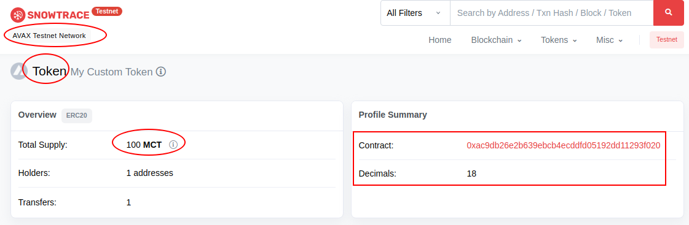
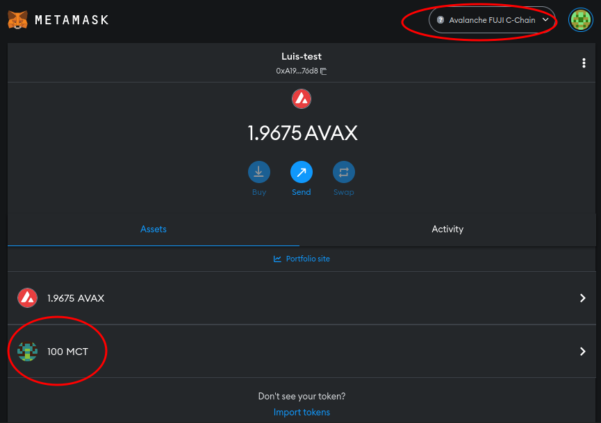

# ERC20 in Avalanche Testnet
This tutorial helped me learn the principles and fundamentals of Avalanche blockchain and the benefits it claims over Ethereum. I also followed it to create an ERC20 token in Avalanche FUJI Testnet blockchain (EVM compatible)

> [Medium: How To Deploy an ERC-20 Smart Contract on Avalanche With Infura](https://betterprogramming.pub/how-to-deploy-an-erc-20-smart-contract-on-avalanche-with-infura-3214cc0812f0)

Good Training!!! :muscle: :thumbsup:

---
## Evidence of completion

My ERC20 in Avalanche Testnet Explorer




Tokens in my Wallet



---
## Deploy your token in Avalanche yourself:

* Requirements:
    
    Follow the link mentioned above for tools that should be installed

* Clone this repo in your folder of preference
```bash
mkdir avax
cd avax
git clone https://github.com/luigicallero/ERC20_in_Avalanche.git
cd ERC20_in_Avalanche
npm install
```
* Remember to change the name of file .env_sample to .env and update the variables inside of the files with correct values

